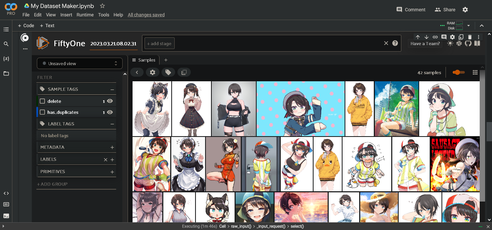

# Kohya Colabs

Accessible Google Colab notebooks for Stable Diffusion Lora training, based on the work of [kohya-ss](https://github.com/kohya-ss/sd-scripts) and [Linaqruf](https://github.com/Linaqruf/kohya-trainer).

If you need support I now have a public [Discord server](https://discord.com/invite/hGHnfda)

You can support me on [Buy me a coffee](https://buymeacoffee.com/holostrawberry)

| |🇬🇧 English|🇪🇸 Spanish|
|:--|:-:|:-:|
| 📊 **Dataset Maker** |  |  |
| ⭐ **Lora Trainer** |  |  |
| 🌟 **XL Lora Trainer** |  | - |
| 🌟 **Legacy XL Trainer** |  | - |
| **Lora making Guide** | [Click Here](https://civitai.com/models/22530) | - |
| **Stable Diffusion guide** | [Click Here](https://huggingface.co/hollowstrawberry/stable-diffusion-guide/blob/main/README.md#index) | [Click Aquí](https://huggingface.co/hollowstrawberry/stable-diffusion-guide/blob/main/spanish.md#index) |

### 📊 Dataset Maker - Features

* Able to scrape hundreds of images from the popular anime gallery [Gelbooru](https://gelbooru.com/index.php?page=wiki&s=view&id=18780), that match the conditions set by the user.
* Finds duplicate images using the [FiftyOne](https://docs.voxel51.com/) open-source software.
* Displays the user's dataset back to them through the FiftyOne interface so that they may manually curate their images.
* Able to generate tags for all your anime images using the [Waifu Diffusion 1.4 Tagger](https://huggingface.co/SmilingWolf/wd-v1-4-swinv2-tagger-v2) model.
* Able to generate captions for all your images using the [BLIP](https://huggingface.co/spaces/Salesforce/BLIP) model.
* Gives you the ability to edit hundreds of text files at once, to add/remove/replace tags inside them dynamically.
* Works inside your Google Drive by default.
* Connects easily with Lora Trainer.

### 🌟 XL Lora Trainer

* Can train LoRA and LoCon for Stable Diffusion XL, includes several model options for anime.
* One click to install and start training.
* Can work with multiple colab configurations, including T4 (free) and A100.
* Offers most parameters while setting useful values behind the scenes to keep it simple.
* Allows you to optionally define multiple folders for training.
* Uses the latest technologies to train quickly.
* Works inside your Google Drive by default and connects easily with Dataset Maker.

&nbsp;

